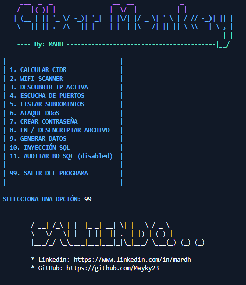

# 🔐📶⚠️ CIBER MONKEY 🔐📶⚠️
- Herramienta propia de pentesting llamada Ciber Monkey, durante el desarrollo de esta toolBox he aprendido una gran cantidad de cosas sobre las vulnerabilidades existentes, además de desarollar mis habilidades como pentester y programador. 


## Ejecutar : 🚀

## Linux

### Actualizar/Instalar Librerías: 

Actualizar/Instalar librerías con apt:
```bash
  sudo apt update && sudo apt upgrade -y
```
### Instalar Git:
```bash
  sudo apt install git -y
```

### Clonar el repositorio Ciber Monkey:
```bash
  git clone git://github.com/Mayky23/Ciber_Monkey.git
```

### Entar al proyecto:

```bash
  cd Ciber_Monkey
```
### Instalar librerías de Python con pip una vez dentro del directorio de tu proyecto:

```bash
  pip install -r requirements.txt
```

#### En caso de error...
```bash
  pip requests pywifi comtypes python-nmap pytz anytree cryptography dnspython ipy netifaces scapy libpcap pypcap pymysql colorama GitPython sublist3r pyfiglet
```

### Ejecutar Ciber Monkey:
```bash
  python3 CiberMonkey.py
```

### Comando único:
```bash
  sudo apt update && sudo apt upgrade -y && sudo apt install git -y && git clone git://github.com/Mayky23/Ciber_Monkey.git && cd Ciber_Monkey && pip install -r requirements.txt && python3 CiberMonkey.py

```
## Windows

Para que la herramienta también funcione en sistemas Windows, asegúrate de tener Python instalado en tu sistema y sigue los mismos pasos para clonar el repositorio y instalar las dependencias utilizando pip. Una vez hecho esto, puedes ejecutar la herramienta utilizando el comando:

```bash
  python CiberMonkey.py
```

## Imágenes : 📸



## Authors : 

- [@Mayky23](https://github.com/Mayky23)
