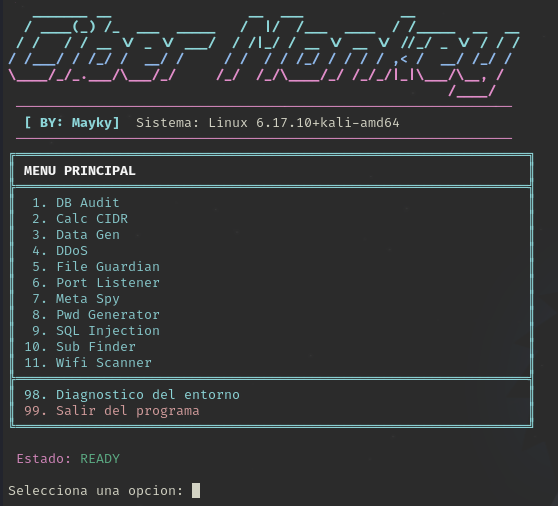

# Ciber Monkey

Ciber Monkey es una toolbox de ciberseguridad en Python pensada para tener, en un solo menu, utilidades de apoyo para laboratorio, auditoria y testing autorizado. Combina scripts propios con integraciones sencillas de herramientas conocidas como `nmap`, `sqlmap`, `gobuster` o `ffuf`, con una interfaz unificada y facil de lanzar tanto en Linux como en Windows.



## Que incluye

Estas son las herramientas actuales del menu principal:

- `DB Audit`: auditoria guiada de MySQL / MariaDB con revision de permisos, configuracion y columnas sensibles.
- `Calc CIDR`: calcula red, mascara, broadcast y rango de hosts a partir de una IP/CIDR.
- `Data Gen`: genera datos ficticios para pruebas, demos o desarrollo.
- `DDoS`: prueba intensiva de disponibilidad con modos `HTTP/HTTPS`, `TCP` y `UDP`.
- `File Guardian`: cifra y descifra archivos locales.
- `Port Listener`: listener TCP simple para validar conectividad entrante.
- `Meta Spy`: lectura de metadatos y contenido basico de archivos.
- `Pwd Generator`: generador de contrasenas personalizadas.
- `SQL Injection`: wrapper guiado para `sqlmap`, con modo URL GET o formulario.
- `Sub Finder`: enumeracion de subdominios y vhosts usando `gobuster` y `ffuf`.
- `Wifi Scanner`: descubrimiento LAN, puertos y redes WiFi.

## Instalacion rapida

### Linux

```bash
chmod +x install.sh
./install.sh
```

El instalador intenta:

- detectar la distro y usar su gestor de paquetes
- instalar dependencias base y binarios externos
- crear el entorno virtual
- instalar librerias Python desde `requirements.txt`
- reintentar el `venv` fuera del proyecto si la carpeta compartida no admite enlaces simbolicos

### Windows

```powershell
Set-ExecutionPolicy -Scope Process Bypass
.\install.ps1
```

El instalador intenta:

- comprobar Python
- crear el entorno virtual
- instalar dependencias Python
- instalar binarios externos compatibles cuando sea posible

## Instalacion manual

### Linux Debian / Kali / Ubuntu

```bash
sudo apt-get update
sudo apt-get install -y python3 python3-venv python3-pip nmap sqlmap gobuster ffuf libpcap-dev iputils-ping
python3 -m venv ~/.virtualenvs/ciber_monkey
source ~/.virtualenvs/ciber_monkey/bin/activate
python -m pip install --upgrade pip setuptools wheel
python -m pip install -r requirements.txt
```

### Windows

```powershell
py -3 -m venv .venv
.\.venv\Scripts\Activate.ps1
python -m pip install --upgrade pip setuptools wheel
python -m pip install -r requirements.txt
```

## Como se ejecuta

### Linux

```bash
source ~/.virtualenvs/ciber_monkey/bin/activate
python CiberMonkey.py
```

### Windows

```powershell
.\.venv\Scripts\Activate.ps1
python CiberMonkey.py
```

## Dependencias importantes

### Binarios externos

- `nmap`
- `sqlmap`
- `gobuster`
- `ffuf`
- `ping`

### Librerias Python

- `requests`
- `cryptography`
- `pymysql`
- `dnspython`
- `exifread`
- `scapy`
- `pywifi`

## Dependencias por herramienta

- `DB Audit`: requiere acceso a un servidor `MySQL/MariaDB`.
- `Calc CIDR`: solo Python estandar.
- `Data Gen`: solo Python estandar.
- `DDoS`: solo Python estandar.
- `File Guardian`: requiere `cryptography`.
- `Port Listener`: solo Python estandar.
- `Meta Spy`: usa `exifread`.
- `Pwd Generator`: solo Python estandar.
- `SQL Injection`: requiere `sqlmap`.
- `Sub Finder`: requiere `gobuster` y/o `ffuf`.
- `Wifi Scanner`: usa `scapy`, `pywifi` y `nmap` segun disponibilidad.

## Lab de pruebas

Dentro de [lab](lab) tienes un entorno sencillo para pruebas locales:

- frontend simple para abrir con Go Live
- backend minimo con Python para exponer endpoints HTTP
- contador TCP para validar pruebas de disponibilidad y listener

Esto te permite probar de forma rapida:

- `DDoS`
- `SQL Injection`
- `Port Listener`

## Flujo recomendado

1. Instala dependencias con `install.sh` o `install.ps1`.
2. Lanza `python CiberMonkey.py`.
3. Ejecuta la opcion `98` para revisar el entorno.
4. Prueba primero las herramientas locales o de laboratorio.
5. Usa funciones ofensivas solo sobre objetivos autorizados.

## Notas

- Algunas funciones de red pueden requerir privilegios elevados.
- `pywifi` puede no estar disponible o comportarse distinto segun el sistema.
- En carpetas compartidas, el `venv` puede fallar por temas de enlaces simbolicos; el instalador ya contempla ese caso.
- Si falta una herramienta externa, el diagnostico interno te lo indicara.

## Uso autorizado

Este proyecto esta pensado para:

- laboratorios
- maquinas propias
- entornos de pruebas
- auditorias con permiso expreso

No lo uses contra sistemas o terceros sin autorizacion.

## Autor

- GitHub: [@Mayky23](https://github.com/Mayky23)
